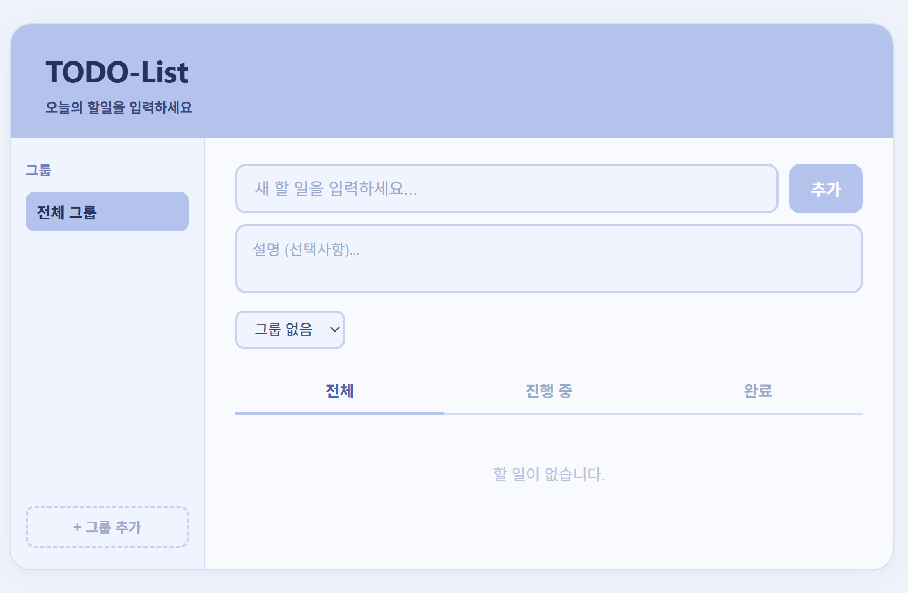

# TODO-List

오늘의 할 일을 관리하는 심플한 웹 애플리케이션입니다.  
별도의 설치나 서버 없이 브라우저에서 바로 실행할 수 있습니다.

---

## 스크린샷



---

## 주요 기능

### 할일 관리
- 할일 제목과 설명(Description)을 함께 입력 가능
- 체크박스로 완료 처리 → 완료 탭으로 자동 분류
- 완료 시각을 `YYYY-MM-DD HH:mm` 형식으로 자동 기록

### 탭 필터링
| 탭 | 표시 항목 |
|---|---|
| 전체 | 모든 할일 |
| 진행 중 | 완료되지 않은 항목 |
| 완료 | 완료된 항목 |

### 그룹 관리
- 그룹을 자유롭게 추가 / 삭제 (Home, Work 등 이름 자유 지정)
- 할일 생성 시 그룹 지정 가능
- 사이드바에서 그룹 클릭 시 해당 그룹 항목만 표시

### 완료 항목 삭제
- 완료 항목은 체크박스로 선택 후 일괄 삭제
- 여러 항목 동시 선택 가능

---

## 기술 스택

| 구분 | 내용 |
|---|---|
| 마크업 | HTML5 |
| 스타일 | CSS3 (파스텔 톤 커스텀 디자인) |
| 로직 | Vanilla JavaScript (ES6+) |
| 외부 라이브러리 | 없음 |

---

## 파일 구조

```
todo_list/
├── index.html   # 페이지 구조
├── style.css    # 스타일 (파스텔 테마)
└── script.js    # 전체 동작 로직
```

---

## 실행 방법

별도 설치 필요 없음. `index.html` 파일을 브라우저에서 열면 바로 실행됩니다.

```
todo_list/index.html 더블클릭
```

---

## 사용 방법

1. **그룹 만들기** — 사이드바 하단 `+ 그룹 추가` 클릭 후 이름 입력
2. **할일 추가** — 제목 입력 → 설명 작성(선택) → 그룹 지정(선택) → `추가` 버튼 또는 `Enter`
3. **완료 처리** — 할일 항목 왼쪽 체크박스 클릭
4. **그룹별 보기** — 사이드바에서 원하는 그룹 클릭
5. **완료 항목 삭제** — 완료 탭에서 삭제할 항목 체크 → `선택 삭제` 클릭

---

## 알려진 한계 (Known Issues)

- **데이터 미저장** — 브라우저를 새로고침하거나 닫으면 입력한 데이터가 초기화됩니다. (localStorage 연동 예정)
- **모바일 최적화 미완성** — 사이드바 레이아웃이 좁은 화면에서 일부 깨질 수 있습니다.
- **그룹 이름 수정 불가** — 현재 그룹 이름은 생성 후 변경할 수 없습니다.

---

## 향후 개발 계획 (Roadmap)

- [ ] localStorage를 이용한 데이터 영구 저장
- [ ] 할일 마감일(Due Date) 설정 기능
- [ ] 우선순위(높음 / 보통 / 낮음) 설정 기능
- [ ] 그룹 이름 수정 기능
- [ ] 모바일 반응형 레이아웃 개선
- [ ] 할일 드래그 앤 드롭으로 순서 변경
- [ ] 다크 모드 지원

---

## 기여 방법 (Contributing)

1. 이 저장소를 Fork합니다.
2. 새 브랜치를 생성합니다.
   ```bash
   git checkout -b feature/기능명
   ```
3. 변경 사항을 커밋합니다.
   ```bash
   git commit -m "feat: 기능 설명"
   ```
4. 브랜치에 Push합니다.
   ```bash
   git push origin feature/기능명
   ```
5. Pull Request를 생성합니다.

---

## 라이선스 (License)

This project is licensed under the [MIT License](LICENSE).
